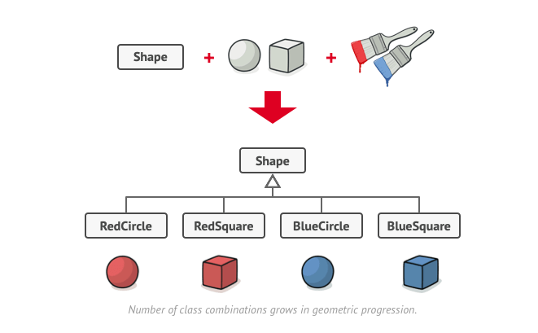
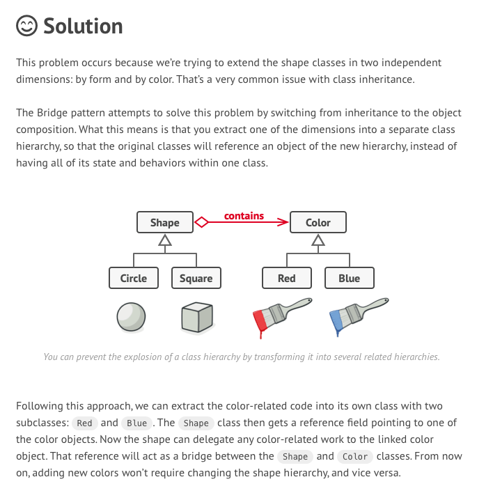

## Major Consideration ##
- Decouple abstraction and implementation by utilization of encapsulation, compositation and inheritance
- Changes in abstraction wont affect client
- Targeted for new code
- Example : <b>
Jdbc <b>

## Problems ##
Say you have a geometric Shape class with a pair of subclasses: Circle and Square. 
You want to extend this class hierarchy to incorporate colors, so you plan to create Red and Blue shape subclasses.
 However, since you already have two subclasses, you’ll need to create four class combinations such as BlueCircle and RedSquare.

Number of class combinations grows in geometric progression.Adding new shape types and colors to the hierarchy will grow it exponentially. For example, to add a triangle shape you’d need to introduce two subclasses, one for each color. And after that, adding a new color would require creating three subclasses, one for each shape type. The further we go, the worse it becomes.



```js
package problem;

public abstract class Shape {
    public Shape() {
    }

    abstract public void applyColor();
}
```

```js
package problem;

public abstract class Square extends Shape {
}

```

```js
package problem;

public abstract class Circle extends Shape {
}

```
```js
package problem;

public class RedCircle extends Circle {
    public void applyColor() {
        System.out.println("Applying red color");
    }
}

```

```js
package problem;

public class RedSquare extends Square {
    public void applyColor() {
        System.out.println("Applying red color");
    }
}
```

```js
package problem;

public class BlueCircle extends Circle {

    public void applyColor() {
        System.out.println("Applying blue color");
    }
}

```

```js
package problem;

public class BlueSquare extends Square {
    public void applyColor() {
        System.out.println("Applying blue color");
    }
}

```

```js
package problem;

public class BridgeDemo {
    public static void main(String [] args){

        Circle circle=new BlueCircle();
        Square square=new RedSquare();

        circle.applyColor();
        square.applyColor();

    }
}
```

## Solution ## 
