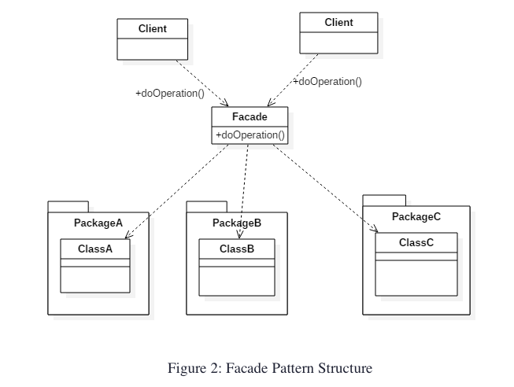

## Introduction about Facade Pattern ##
- The Facade pattern promotes decoupling the subsystem from its potentially many clients by encapsulating a complex subsystem within a single interface object. 
This reduces the communication and dependencies between the subsystems and reduces the complexity of the system.



### Example 1: Facade Design Pattern ###
```java
package example.one;

import java.sql.Connection;

public class MySqlHelper {

    public static Connection getMySqlDBConnection(){
        //get MySql DB connection using connection parameters
        return null;
    }

    public void generateMySqlPDFReport(String tableName, Connection con){
        //get data from table and generate pdf report
    }

    public void generateMySqlHTMLReport(String tableName, Connection con){
        //get data from table and generate pdf report
    }
}

```
```java
package example.one;

import java.sql.Connection;

public class OracleHelper {

    public static Connection getOracleDBConnection(){
        //get Oracle DB connection using connection parameters
        return null;
    }

    public void generateOraclePDFReport(String tableName, Connection con){
        //get data from table and generate pdf report
    }

    public void generateOracleHTMLReport(String tableName, Connection con){
        //get data from table and generate pdf report
    }
}

```

```java
package example.one;

import java.sql.Connection;

public class DbFacade {
    public static void generateReport(DBTypes dbType, ReportTypes reportType, String tableName){
        Connection con = null;
        switch (dbType){
            case MYSQL:
                con = MySqlHelper.getMySqlDBConnection();
                MySqlHelper mySqlHelper = new MySqlHelper();
                switch(reportType){
                    case HTML:
                        mySqlHelper.generateMySqlHTMLReport(tableName, con);
                        break;
                    case PDF:
                        mySqlHelper.generateMySqlPDFReport(tableName, con);
                        break;
                }
                break;
            case ORACLE:
                con = OracleHelper.getOracleDBConnection();
                OracleHelper oracleHelper = new OracleHelper();
                switch(reportType){
                    case HTML:
                        oracleHelper.generateOracleHTMLReport(tableName, con);
                        break;
                    case PDF:
                        oracleHelper.generateOraclePDFReport(tableName, con);
                        break;
                }
                break;
        }

    }

    public static enum DBTypes{
        MYSQL,ORACLE;
    }

    public static enum ReportTypes{
        HTML,PDF;
    }
}

```

```java
package example.one;

import java.sql.Connection;

public class NexusRunner {
    public static void main(String[] args) {
        String tableName="Employee";

        //generating MySql HTML report and Oracle PDF report without using Facade
        Connection con = MySqlHelper.getMySqlDBConnection();
        MySqlHelper mySqlHelper = new MySqlHelper();
        mySqlHelper.generateMySqlHTMLReport(tableName, con);

        Connection con1 = OracleHelper.getOracleDBConnection();
        OracleHelper oracleHelper = new OracleHelper();
        oracleHelper.generateOraclePDFReport(tableName, con1);

        //generating MySql HTML report and Oracle PDF report using Facade
        DbFacade.generateReport(DbFacade.DBTypes.MYSQL, DbFacade.ReportTypes.HTML, tableName);
        DbFacade.generateReport(DbFacade.DBTypes.ORACLE, DbFacade.ReportTypes.PDF, tableName);
    }
}
```

### Example 2: facade design pattern ###
```java
package example.two;

public class CarEngine {
    public void setCarEngine(){
        System.out.println("Car Engine is set.");
    }
}

```

```java
package example.two;

public class CarBody {
    public void setCarBody(){
        System.out.println("Car body is set.");
    }
}

```

```java
package example.two;

public class CarAccessories {
    public void setCarAccessories(){
        System.out.println("Car accessories are set.");
    }
}

```

```java
package example.two;

public class CarFacade {

    private CarEngine engine;
    private CarBody body;
    private CarAccessories accessories;
    public CarFacade(){
        this.engine = new CarEngine();
        this.body = new CarBody();
        this.accessories = new CarAccessories();
    }
    public void createCar(){
        System.out.println("Creating a car...");
        engine.setCarEngine();
        body.setCarBody();
        accessories.setCarAccessories();
        System.out.println("Your car is ready.");
    }
}

```

```java
package example.two;

public class NexusRunner {
    public static void main(String[] args) {
        CarFacade facade = new CarFacade();
        facade.createCar();
    }
}

```