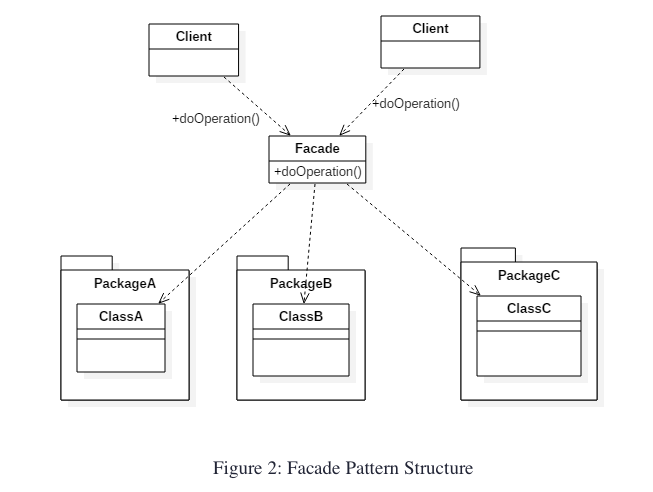

## Introduction about Facade Pattern ##
- The Facade pattern promotes decoupling the subsystem from its potentially many clients by encapsulating a complex subsystem within a single interface object. 
This reduces the communication and dependencies between the subsystems and reduces the complexity of the system.

