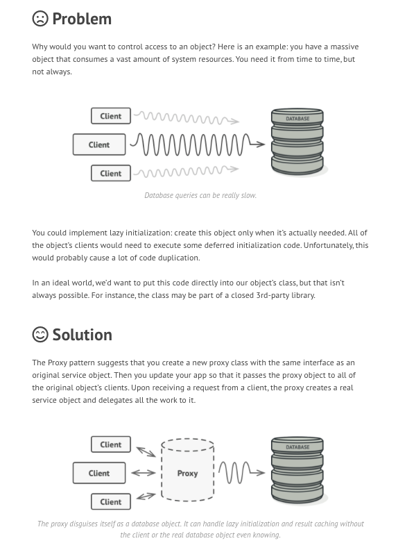

## Introduction ##
- This design pattern is based on interface
- In proxy design pattern, a class represents functionality of another class.

### Example in Java ##
```java
java.lang.reflect.Proxy
java.rmi.*

```

## Why we need proxy design pattern ##
### Scenario 1: ###
<br/>


### Scenario 2: ###
One example of a virtual proxy is loading images. Let's imagine that we're building a file manager. 
Like any other file manager, this one should be able to display images in a folder that a user decides to open.

If we assume there exists a class, ImageViewer, responsible for loading and displaying images - we might implement our file manager by using this class directly.
 This kind of approach seems logical and straight-forward but it contains a subtle problem.

If we implement the file manager as described above, we're going to be loading images every time they appear in the folder. 
If the user only wishes to see the name or size of an image, this kind of approach would still load the entire image into memory.
 Since loading and displaying images are expensive operations, this can cause performance issues.

A better solution would be to display images only when actually needed. 
In this sense, we can use a proxy to wrap the existing ImageViewer object. 
This way, the actual image viewer will only get called when the image needs to be rendered.
 All other operations (such as obtaining the image name, size, date of creation, etc.) don't require the actual image and can therefore be obtained through a much lighter proxy object instead.


## Example 1: ## 
- Let's first create our main interface:
```java
package example.first;

public interface ImageViewer {
    public void displayImage();
}

```
- Next, we'll implement the concrete image viewer. Note that operations occurring in this class are costly:

```java
package example.first;

import com.sun.prism.Image;

public class ConcreteImageViewer implements ImageViewer {

    private Image image;

    public ConcreteImageViewer(String path) {
        // Costly operation
        this.image = Image.load(path);
    }

    @Override
    public void displayImage() {
        // Costly operation
        image.display();
    }
}

```

- Now we'll implement our lightweight image viewer proxy. This object will call the concrete image viewer only when needed, i.e. when the client calls the displayImage() method. Until then, no images will be loaded or processed, which will make our program much more efficient.

```java
package example.first;

public class ImageViewerProxy implements ImageViewer {

    private String path;
    private ImageViewer viewer;

    public ImageViewerProxy(String path) {
        this.path = path;
    }

    @Override
        public void displayImage() {
            if (this.viewer == null) {
                this.viewer = new ConcreteImageViewer(this.path);
            }
            this.viewer.displayImage();
        }

}
```
- Finally, we'll write the client-side of our program. In the code below, we are creating six different image viewers. 
First, three of them are the concrete image viewers that automatically load images on creation. 
The last three images don't load any images into memory on creation.
  
- Only with the last line will the first proxy viewer start loading the image. 
Compared to the concrete viewers, performance benefits are obvious:

```java
package example.first;

public class NexusRunner {
    public static void main(String[] args) {
        ImageViewer flowers = new ConcreteImageViewer("./photos/flowers.png");
        ImageViewer trees = new ConcreteImageViewer("./photos/trees.png");
        ImageViewer grass = new ConcreteImageViewer("./photos/grass.png");

        ImageViewer sky = new ImageViewerProxy("./photos/sky.png");
        ImageViewer sun = new ImageViewerProxy("./photos/sun.png");
        ImageViewer clouds = new ImageViewerProxy("./photos/clouds.png");

        sky.displayImage();
    }
}

```

## Example 2: ##
```java
package example.second;

public interface Spaceship {
    public void fly();
}

```

```java
package example.second;

public class MillenniumFalcon implements Spaceship {
    @Override
    public void fly() {
        System.out.println("Welcome, Raj. The Millennium Falcon is starting up its engines!");
    }
}

```

```java
package example.second;

public class Pilot {
    private String name;

    public Pilot(String name) {
        this.name = name;
    }

    public String getName() {
        return name;
    }

}

```

```java
package example.second;

public class MillenniumFalconProxy implements Spaceship {

    private Pilot pilot;
    private Spaceship falcon;

    public MillenniumFalconProxy(Pilot pilot) {
        this.pilot = pilot;
        this.falcon = new MillenniumFalcon();
    }

    @Override
    public void fly() {
        if (pilot.getName().equals("Han Solo")) {
            falcon.fly();
        } else {
            System.out.printf("Sorry %s, only Han Solo can fly the Falcon!\n", pilot.getName());
        }
    }
}
```

```java
package example.second;

public class FalconRunner {
    public static void main(String[] args){
        Spaceship falcon1 = new MillenniumFalconProxy(new Pilot("Raj Bhatta"));
        falcon1.fly();

        Spaceship falcon2 = new MillenniumFalconProxy(new Pilot("Programmer Bhatta"));
        falcon2.fly();
    }
}

```